# IT Service Desk Sandbox - Jira Service Management + Confluence

A self-built IT service desk environment simulating how a real IT team receives, triages, tracks, and resolves internal requests. Built solo as a hands-on systems exercise using Atlassian's free tier.

## Summary

Configured a Jira Service Management project with 6 custom request types, 5 queues, 2 SLA policies, and 5 automation rules; documented the full service configuration and a simulated asset inventory (CMDB) in Confluence to model an active IT service desk.

## What this demonstrates

- Designing customer-facing intake forms with custom fields tailored to request type
- Triage and routing logic via JQL-based queues
- SLA policy design (response and resolution targets by priority)
- Workflow automation (auto-assignment, escalation, auto-closure, breach alerting)
- Service documentation and knowledge management in Confluence
- End-to-end IT service management (ITSM) process design, from intake to resolution

## Tools

Jira Service Management (team-managed project) · Confluence · JQL · Automation for Jira

---

## 1. Customer Portal

Six request types grouped into five portal categories so end users can quickly find the right form.

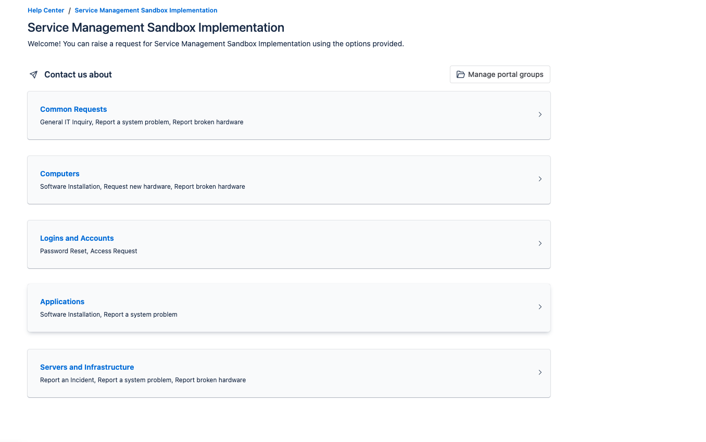

**Hardware Request** - request a laptop, monitor, keyboard, or other equipment.

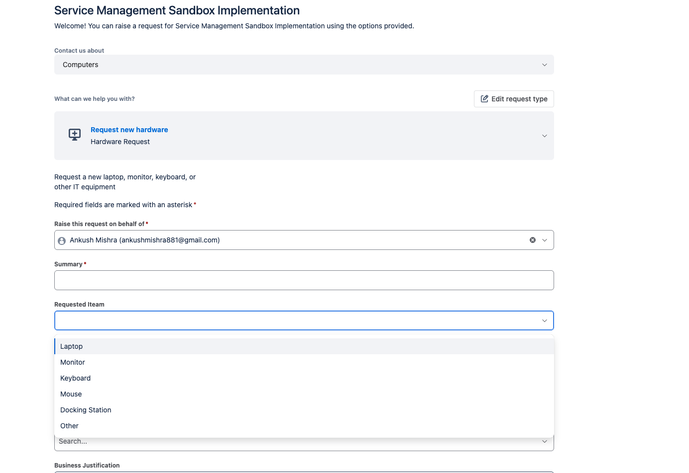

**Software Installation** - request installation or licensing of approved software.

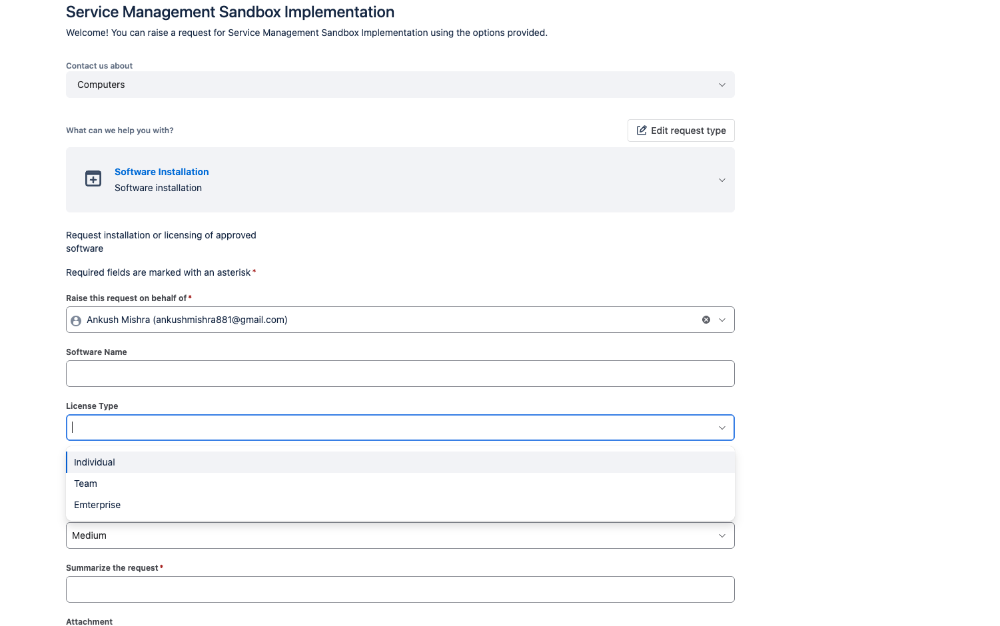

The full set of request types: Hardware Request, Software Installation, Access Request, Password Reset, Report an Incident, and General IT Inquiry - each with its own description and custom fields (Requested Item, Department, Business Justification, Access Level, Manager Approval, Impact, Affected System, and Priority).

## 2. Request Type Configuration

Each request type's form was built with fields specific to what an agent actually needs to act on the ticket.

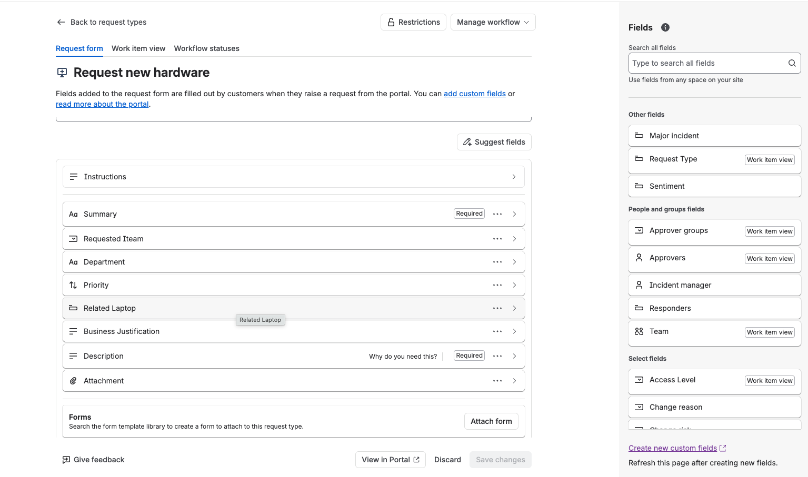

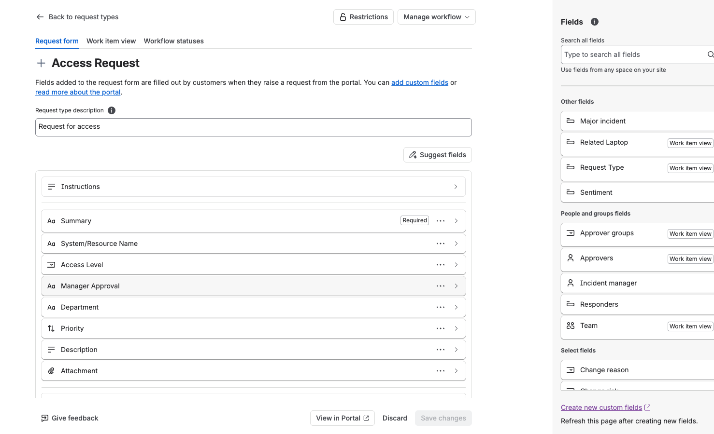

## 3. Queues

Five JQL-driven queues route tickets to the right view: unassigned work, personal open tickets, high-priority items, access/software requests, and SLA breaches.

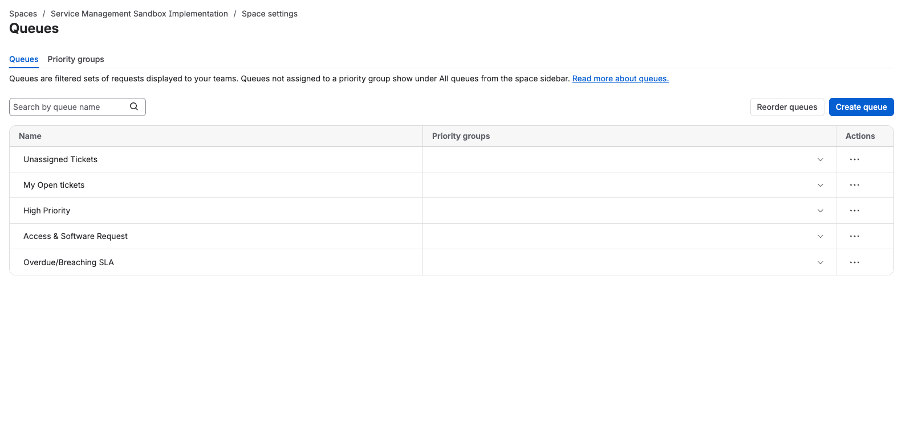

| Queue | JQL | Purpose |
|---|---|---|
| Unassigned Tickets | `assignee is EMPTY AND status != Closed` | Surface work nobody has picked up |
| My Open Tickets | `assignee = currentUser() AND status not in (Resolved, Closed)` | Personal worklist |
| High Priority | `priority in (Highest, High) AND status != Closed` | Focus on urgent tickets |
| Access & Software Requests | `"Request Type" in ("Access Request", "Software Installation")` | Group approval-driven requests |
| Overdue / Breaching SLA | `"Time to resolution" breached() OR "Time to first response" breached()` | Catch tickets at risk |

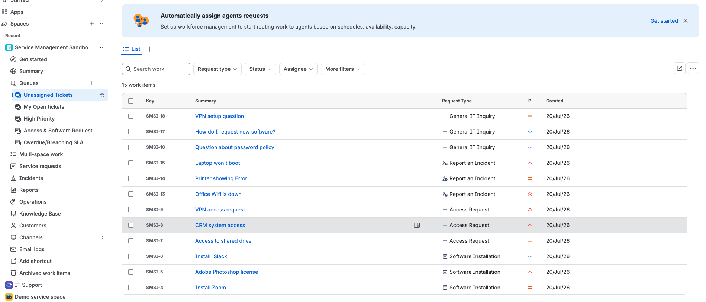

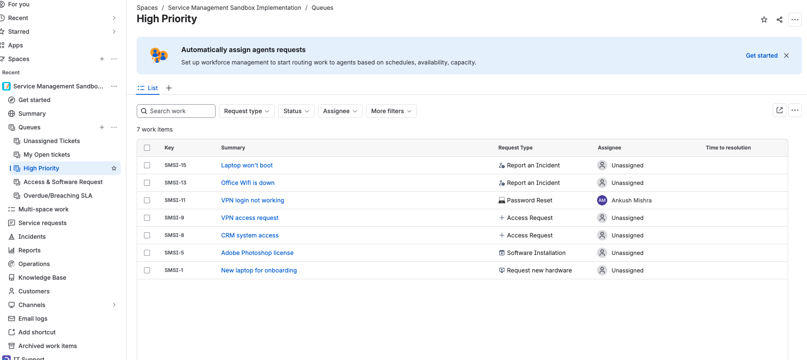


15–20 sample tickets were created across all six request types and priority levels, with several moved through to Resolved/Closed so the queues reflect a realistic operational mix.

## 4. SLAs

Two SLA policies with goals tiered by priority.

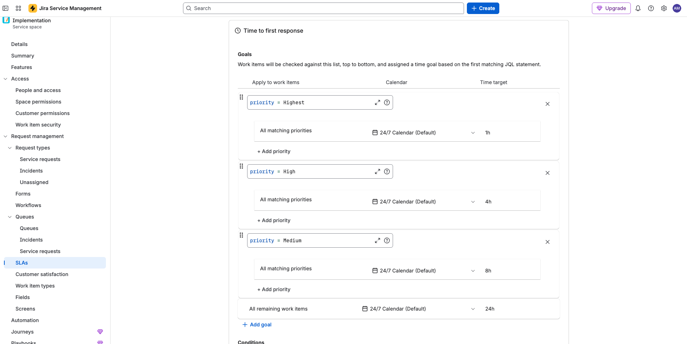

- **Time to first response** - starts on ticket creation, stops when an agent first responds or the status leaves Open. Goals: Highest = 1h, High = 4h, Medium = 8h, Low = 24h.
- **Time to resolution** - starts on ticket creation, pauses while status is "Waiting for customer," stops when status = Resolved. Goals: Highest = 4h, High = 1 business day, Medium = 3 business days, Low = 40h.

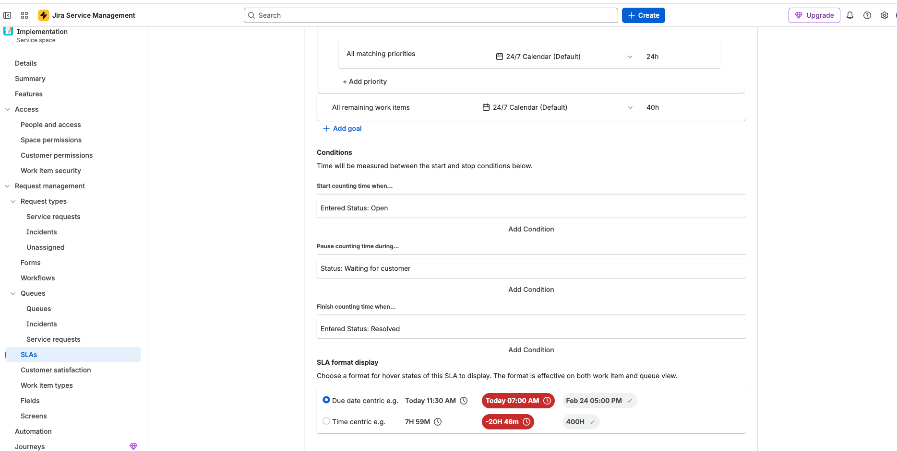

## 5. Automation

Five automation rules handle routing, notification, escalation, and cleanup without manual intervention.

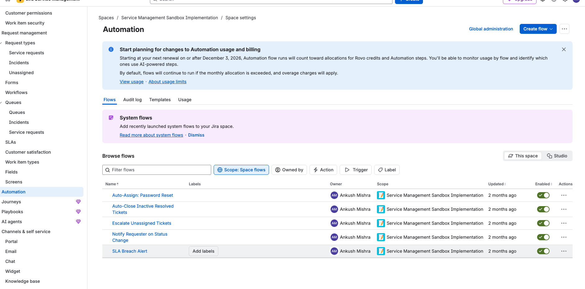

| Rule | Trigger | Condition | Action |
|---|---|---|---|
| Auto-assign: Password Reset | Issue created | Request Type = "Password Reset" | Assign to self |
| Notify Requester on Status Change | Issue transitioned | - | Email the reporter with the new status |
| Escalate Unassigned Tickets | Scheduled, daily 9am | Unassigned AND Open AND >4h old | Comment "Escalated" + set Priority = High |
| Auto-Close Inactive Resolved Tickets | Scheduled, daily | Resolved AND unchanged 5 days | Transition to Closed + comment |
| SLA Breach Alert | SLA threshold breached | - | Email project lead + comment |


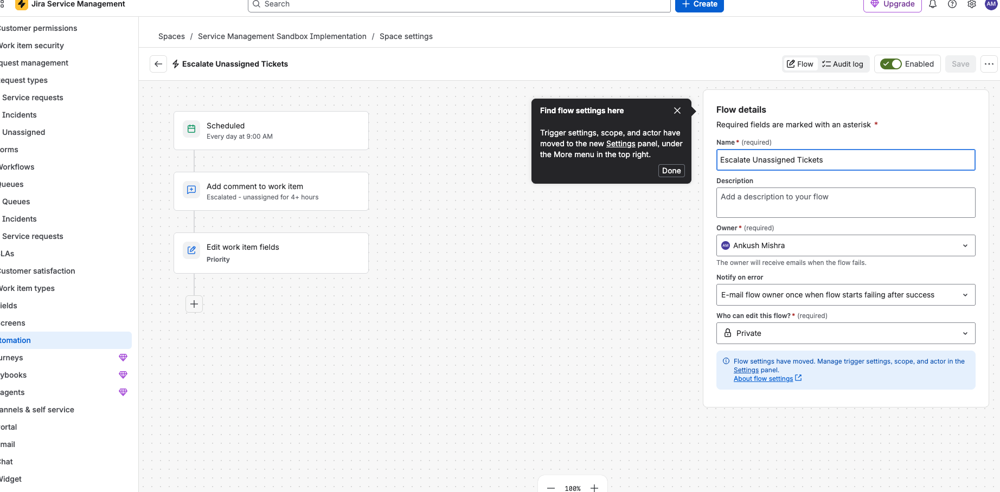


## 6. Documentation (Confluence)

A dedicated Confluence space, **IT Service Desk Knowledge Base**, documents the whole configuration so it's maintainable rather than tribal knowledge: a service catalog, request type configuration reference, automation rule log, queue definitions, a simulated asset inventory (CMDB) standing in for Jira Assets (a Premium-only feature), SOPs, and end-user knowledge base articles.


---

## Repo structure

```
.
├── README.md
└── screenshots/
    ├── 01-customer-portal-home.png
    ├── 02-request-form-hardware.png
    ├── 03-request-form-software-installation.png
    ├── 04-request-type-config-hardware.png
    ├── 05-request-type-config-access-request.png
    ├── 06-queues-list.png
    ├── 07-queue-unassigned-tickets.png
    ├── 08-queue-high-priority.png
    ├── 09-queue-overdue-breaching-sla.png
    ├── 10-sla-time-to-first-response.png
    ├── 11-sla-time-to-resolution-conditions.png
    ├── 12-automation-rules-list.png
    ├── 13-automation-escalate-unassigned-tickets.png
    ├── 14-automation-sla-breach-alert.png
    └── 15-confluence-knowledge-base-space.png
```
